<h1>Welcome! 🙋‍♂️</h1>

[![Website: hans5958.github.io]](https://hans5958.github.io)
[![Blog: hans5958.github.io/blog]](https://hans5958.github.io/blog)  
[![GitHub: hans5958]](https://github.com/Hans5958) 
[![GitLab: hans5958]](https://gitlab.com/Hans5958) 
[![Twitter: Hans5958]](https://twitter.com/Hans5958)
[![Mastodon: Hans5958@mastodon.social]](https://mastodon.social/@Hans5958)
[![YouTube: Hans5958]](https://youtube.com/Hans5958) 
[![Reddit: Hans5958_]](https://reddit.com/u/Hans5958_) 
[![Lemmy: Hans5958@lemmy.world]](https://lemmy.world/u/Hans5958) 

FYI: It is **09:xx** (**9am**) in Jakarta. :sunny:    
*I'm online, doing stuff, and is able to respond to inquiries.* 

<details><summary><a href=https://hans5958.github.io/#about>Read about me:</a></summary>

## About me

*This section can be read on https://hans5958.github.io/#about.*

</details>

<details><summary>Recent activity:</summary>

## Recent activity

### Last ten commits

- [`3286813`](https://github.com/ScratchAddons/contributors/commit/3286813cbf6d5556572819e04f467a974a30188c) Rename thenatally to tallypaws ([ScratchAddons/contributors](https://github.com/ScratchAddons/contributors), [master](https://github.com/ScratchAddons/contributors/tree/master))
- [`55dcf56`](https://github.com/ScratchAddons/website-v2/commit/55dcf5663674115ae8d7f66e41c4a110d06f8974) Merge pull request #564 from mxmou/cover-images ([ScratchAddons/website-v2](https://github.com/ScratchAddons/website-v2), [master](https://github.com/ScratchAddons/website-v2/tree/master))
- [`5de9543`](https://github.com/ScratchAddons/website-v2/commit/5de95432d89f1485d571f332c58b35dc1194f362) Remove folders feedback presend warning ([ScratchAddons/website-v2](https://github.com/ScratchAddons/website-v2), [master](https://github.com/ScratchAddons/website-v2/tree/master))
- [`b2f73cb`](https://github.com/ScratchAddons/website-v2/commit/b2f73cbf1cba6807e28f2f5da7a0db598823ca55) Remove analytics code ([ScratchAddons/website-v2](https://github.com/ScratchAddons/website-v2), [master](https://github.com/ScratchAddons/website-v2/tree/master))
- [`652672e`](https://github.com/ScratchAddons/website-v2/commit/652672e6f2b6c9cdcb7e479ae5b2b5342ac11537) Bump Hugo to 0.151.2, add version note on README ([ScratchAddons/website-v2](https://github.com/ScratchAddons/website-v2), [master](https://github.com/ScratchAddons/website-v2/tree/master))
- [`1fa71c5`](https://github.com/Hans5958/VocaDB-Wiki/commit/1fa71c58f31b51b6d4c1607a25b8a5f251f3093c) Format code ([Hans5958/VocaDB-Wiki](https://github.com/Hans5958/VocaDB-Wiki), [clarifications/no-default-avatars](https://github.com/Hans5958/VocaDB-Wiki/tree/clarifications/no-default-avatars))
- [`8cb74d6`](https://github.com/Hans5958/VocaDB-Wiki/commit/8cb74d692b00e131c7a55df9d32d9ba9c3d60936) Increase Pagefind weight for RuleEmbed outside rule pages ([Hans5958/VocaDB-Wiki](https://github.com/Hans5958/VocaDB-Wiki), [layout/pagefind-weighting](https://github.com/Hans5958/VocaDB-Wiki/tree/layout/pagefind-weighting))
- [`9cab873`](https://github.com/Hans5958/VocaDB-Wiki/commit/9cab873ab0e53d2d22fde89a4a3f3ef6865d0d98) Clarify voicebank credit rules ([Hans5958/VocaDB-Wiki](https://github.com/Hans5958/VocaDB-Wiki), [clarifications/voicebank-credit](https://github.com/Hans5958/VocaDB-Wiki/tree/clarifications/voicebank-credit))
- [`88d3c32`](https://github.com/Hans5958/vocadb/commit/88d3c3271ad108743b9387de8317f6cf0c45dff7) Add more YouTube link matchers ([Hans5958/vocadb](https://github.com/Hans5958/vocadb), [patch-2](https://github.com/Hans5958/vocadb/tree/patch-2))
- [`5d24cec`](https://github.com/Hans5958/VocaDB-Wiki/commit/5d24cecf57bc2d6f56b1e5ece69f665a8a47293e) Adjust navbar style ([Hans5958/VocaDB-Wiki](https://github.com/Hans5958/VocaDB-Wiki), [layout/mobile-navbar](https://github.com/Hans5958/VocaDB-Wiki/tree/layout/mobile-navbar))

### Last ten events

- Labeled issue [#2102](https://github.com/VocaDB/vocadb/issues/2102) on [VocaDB/vocadb](https://github.com/VocaDB/vocadb) (2026-02-18T15:33:34Z)
- Opened issue [#2102](https://github.com/VocaDB/vocadb/issues/2102) on [VocaDB/vocadb](https://github.com/VocaDB/vocadb) (2026-02-18T15:33:33Z)
- Labeled issue [#2101](https://github.com/VocaDB/vocadb/issues/2101) on [VocaDB/vocadb](https://github.com/VocaDB/vocadb) (2026-02-18T15:21:34Z)
- Opened issue [#2101](https://github.com/VocaDB/vocadb/issues/2101) on [VocaDB/vocadb](https://github.com/VocaDB/vocadb) (2026-02-18T15:21:34Z)
- Created review on PR [#8845](https://github.com/ScratchAddons/ScratchAddons/issues/8845) on [ScratchAddons/ScratchAddons](https://github.com/ScratchAddons/ScratchAddons) (2026-02-18T15:02:17Z)
- Started [MorpheApp/morphe-patches](https://github.com/MorpheApp/morphe-patches) (2026-02-17T14:50:16Z
- Started [MorpheApp/morphe-manager](https://github.com/MorpheApp/morphe-manager) (2026-02-17T14:50:14Z
- Started [Jman-Github/Universal-ReVanced-Manager](https://github.com/Jman-Github/Universal-ReVanced-Manager) (2026-02-17T14:50:10Z
- Started [anddea/revanced-patches](https://github.com/anddea/revanced-patches) (2026-02-17T14:49:27Z
- Created comment on issue/PR [#714](https://github.com/crimera/piko/issues/714) on [crimera/piko](https://github.com/crimera/piko) (2026-02-16T17:50:56Z)

### Activity graph (beta)

*Only last 100 events are shown.*

```
                                                                                 
                                                                         ▄       
                                                                         █       
                                                                         █       
                                                                         █       
                                                  ▄                      █       
                                                  █                      █       
                                 █                █                      █       
                                 █                █                      █       
                                 █                █                      █       
                      █          █              █ █  █                  ▄█     ▄ 
▄                     █▄         █         ▄    █ █  █▄                 ██ █   █ 
█                     ██   ▄     █         █    █▄█  ██             █   ██ █   █ 
├───────────────────┼───────────────────┼───────────────────┼───────────────────┤
23/01/2026          30/01/2026          05/02/2026          12/02/2026          Now
17:01               07:01               21:02               12:02               
```

### lowlighter/metrics (beta)



</details>

*Last updated: 19/02/2026, 02:32:26 UTC*   
*Commit hash:* [`f633044`](https://github.com/Hans5958/Hans5958/commit/f6330448f7b0a7eca9c6a12b74b263696ea12b19
) <a href="https://github.com/Hans5958/Hans5958/actions?query=workflow%3ABuild"></a>

[Website: hans5958.github.io]: https://img.shields.io/badge/main-hans5958.github.io-black?style=flat-square&logo=data:image/svg+xml;base64,PD94bWwgdmVyc2lvbj0iMS4wIiBlbmNvZGluZz0iVVRGLTgiIHN0YW5kYWxvbmU9Im5vIj8+CjxzdmcKICAgeG1sbnM6ZGM9Imh0dHA6Ly9wdXJsLm9yZy9kYy9lbGVtZW50cy8xLjEvIgogICB4bWxuczpjYz0iaHR0cDovL2NyZWF0aXZlY29tbW9ucy5vcmcvbnMjIgogICB4bWxuczpyZGY9Imh0dHA6Ly93d3cudzMub3JnLzE5OTkvMDIvMjItcmRmLXN5bnRheC1ucyMiCiAgIHhtbG5zOnN2Zz0iaHR0cDovL3d3dy53My5vcmcvMjAwMC9zdmciCiAgIHhtbG5zPSJodHRwOi8vd3d3LnczLm9yZy8yMDAwL3N2ZyIKICAgeG1sbnM6c29kaXBvZGk9Imh0dHA6Ly9zb2RpcG9kaS5zb3VyY2Vmb3JnZS5uZXQvRFREL3NvZGlwb2RpLTAuZHRkIgogICB4bWxuczppbmtzY2FwZT0iaHR0cDovL3d3dy5pbmtzY2FwZS5vcmcvbmFtZXNwYWNlcy9pbmtzY2FwZSIKICAgaW5rc2NhcGU6dmVyc2lvbj0iMS4wICg0MDM1YTRmYjQ5LCAyMDIwLTA1LTAxKSIKICAgc29kaXBvZGk6ZG9jbmFtZT0iZWFydGguc3ZnIgogICBpZD0ic3ZnNiIKICAgdmlld0JveD0iMCAwIDE2IDE2IgogICBoZWlnaHQ9IjE2IgogICB3aWR0aD0iMTYiCiAgIHZlcnNpb249IjEuMSI+CiAgPG1ldGFkYXRhCiAgICAgaWQ9Im1ldGFkYXRhMTIiPgogICAgPHJkZjpSREY+CiAgICAgIDxjYzpXb3JrCiAgICAgICAgIHJkZjphYm91dD0iIj4KICAgICAgICA8ZGM6Zm9ybWF0PmltYWdlL3N2Zyt4bWw8L2RjOmZvcm1hdD4KICAgICAgICA8ZGM6dHlwZQogICAgICAgICAgIHJkZjpyZXNvdXJjZT0iaHR0cDovL3B1cmwub3JnL2RjL2RjbWl0eXBlL1N0aWxsSW1hZ2UiIC8+CiAgICAgIDwvY2M6V29yaz4KICAgIDwvcmRmOlJERj4KICA8L21ldGFkYXRhPgogIDxkZWZzCiAgICAgaWQ9ImRlZnMxMCIgLz4KICA8c29kaXBvZGk6bmFtZWR2aWV3CiAgICAgaW5rc2NhcGU6Y3VycmVudC1sYXllcj0ic3ZnNiIKICAgICBpbmtzY2FwZTp3aW5kb3ctbWF4aW1pemVkPSIxIgogICAgIGlua3NjYXBlOndpbmRvdy15PSItOCIKICAgICBpbmtzY2FwZTp3aW5kb3cteD0iLTgiCiAgICAgaW5rc2NhcGU6Y3k9IjgiCiAgICAgaW5rc2NhcGU6Y3g9IjgiCiAgICAgaW5rc2NhcGU6em9vbT0iMzMuNjI1IgogICAgIHNob3dncmlkPSJmYWxzZSIKICAgICBpZD0ibmFtZWR2aWV3OCIKICAgICBpbmtzY2FwZTp3aW5kb3ctaGVpZ2h0PSI3MDUiCiAgICAgaW5rc2NhcGU6d2luZG93LXdpZHRoPSIxMzY2IgogICAgIGlua3NjYXBlOnBhZ2VzaGFkb3c9IjIiCiAgICAgaW5rc2NhcGU6cGFnZW9wYWNpdHk9IjAiCiAgICAgZ3VpZGV0b2xlcmFuY2U9IjEwIgogICAgIGdyaWR0b2xlcmFuY2U9IjEwIgogICAgIG9iamVjdHRvbGVyYW5jZT0iMTAiCiAgICAgYm9yZGVyb3BhY2l0eT0iMSIKICAgICBib3JkZXJjb2xvcj0iIzY2NjY2NiIKICAgICBwYWdlY29sb3I9IiNmZmZmZmYiIC8+CiAgPHRpdGxlCiAgICAgaWQ9InRpdGxlMiI+ZWFydGg8L3RpdGxlPgogIDxwYXRoCiAgICAgc3R5bGU9ImZpbGw6I2ZmZmZmZiIKICAgICBpZD0icGF0aDQiCiAgICAgZD0iTTggMGMtNC40MTggMC04IDMuNTgyLTggOHMzLjU4MiA4IDggOCA4LTMuNTgyIDgtOC0zLjU4Mi04LTgtOHpNOCAxNWMtMC45ODQgMC0xLjkyLTAuMjAzLTIuNzY5LTAuNTdsMy42NDMtNC4wOThjMC4wODEtMC4wOTIgMC4xMjYtMC4yMSAwLjEyNi0wLjMzMnYtMS41YzAtMC4yNzYtMC4yMjQtMC41LTAuNS0wLjUtMS43NjUgMC0zLjYyOC0xLjgzNS0zLjY0Ni0xLjg1NC0wLjA5NC0wLjA5NC0wLjIyMS0wLjE0Ni0wLjM1NC0wLjE0NmgtMmMtMC4yNzYgMC0wLjUgMC4yMjQtMC41IDAuNXYzYzAgMC4xODkgMC4xMDcgMC4zNjMgMC4yNzYgMC40NDdsMS43MjQgMC44NjJ2Mi45MzZjLTEuODEzLTEuMjY1LTMtMy4zNjYtMy01Ljc0NSAwLTEuMDc0IDAuMjQyLTIuMDkxIDAuNjc0LTNoMS44MjZjMC4xMzMgMCAwLjI2LTAuMDUzIDAuMzU0LTAuMTQ2bDItMmMwLjA5NC0wLjA5NCAwLjE0Ni0wLjIyMSAwLjE0Ni0wLjM1NHYtMS4yMWMwLjYzNC0wLjE4OSAxLjMwNS0wLjI5IDItMC4yOSAxLjEgMCAyLjE0MSAwLjI1NCAzLjA2NyAwLjcwNi0wLjA2NSAwLjA1NS0wLjEyOCAwLjExMi0wLjE4OCAwLjE3Mi0wLjU2NyAwLjU2Ny0wLjg3OSAxLjMyLTAuODc5IDIuMTIxczAuMzEyIDEuNTU1IDAuODc5IDIuMTIxYzAuNTY5IDAuNTY5IDEuMzMyIDAuODc5IDIuMTE5IDAuODc5IDAuMDQ5IDAgMC4wOTktMC4wMDEgMC4xNDktMC4wMDQgMC4yMTYgMC44MDkgMC42MDUgMi45MTctMC4xMzEgNS44MTgtMC4wMDcgMC4wMjctMC4wMTEgMC4wNTUtMC4wMTMgMC4wODItMS4yNzEgMS4yOTgtMy4wNDIgMi4xMDQtNS4wMDIgMi4xMDR6IiAvPgo8L3N2Zz4K
[Blog: hans5958.github.io/blog]: https://img.shields.io/badge/blog-hans5958.github.io/blog-black?style=flat-square&logo=data:image/svg+xml;base64,PD94bWwgdmVyc2lvbj0iMS4wIiBlbmNvZGluZz0iVVRGLTgiIHN0YW5kYWxvbmU9Im5vIj8+CjxzdmcKICAgeG1sbnM6ZGM9Imh0dHA6Ly9wdXJsLm9yZy9kYy9lbGVtZW50cy8xLjEvIgogICB4bWxuczpjYz0iaHR0cDovL2NyZWF0aXZlY29tbW9ucy5vcmcvbnMjIgogICB4bWxuczpyZGY9Imh0dHA6Ly93d3cudzMub3JnLzE5OTkvMDIvMjItcmRmLXN5bnRheC1ucyMiCiAgIHhtbG5zOnN2Zz0iaHR0cDovL3d3dy53My5vcmcvMjAwMC9zdmciCiAgIHhtbG5zPSJodHRwOi8vd3d3LnczLm9yZy8yMDAwL3N2ZyIKICAgeG1sbnM6c29kaXBvZGk9Imh0dHA6Ly9zb2RpcG9kaS5zb3VyY2Vmb3JnZS5uZXQvRFREL3NvZGlwb2RpLTAuZHRkIgogICB4bWxuczppbmtzY2FwZT0iaHR0cDovL3d3dy5pbmtzY2FwZS5vcmcvbmFtZXNwYWNlcy9pbmtzY2FwZSIKICAgaW5rc2NhcGU6dmVyc2lvbj0iMS4wICg0MDM1YTRmYjQ5LCAyMDIwLTA1LTAxKSIKICAgc29kaXBvZGk6ZG9jbmFtZT0iZWFydGguc3ZnIgogICBpZD0ic3ZnNiIKICAgdmlld0JveD0iMCAwIDE2IDE2IgogICBoZWlnaHQ9IjE2IgogICB3aWR0aD0iMTYiCiAgIHZlcnNpb249IjEuMSI+CiAgPG1ldGFkYXRhCiAgICAgaWQ9Im1ldGFkYXRhMTIiPgogICAgPHJkZjpSREY+CiAgICAgIDxjYzpXb3JrCiAgICAgICAgIHJkZjphYm91dD0iIj4KICAgICAgICA8ZGM6Zm9ybWF0PmltYWdlL3N2Zyt4bWw8L2RjOmZvcm1hdD4KICAgICAgICA8ZGM6dHlwZQogICAgICAgICAgIHJkZjpyZXNvdXJjZT0iaHR0cDovL3B1cmwub3JnL2RjL2RjbWl0eXBlL1N0aWxsSW1hZ2UiIC8+CiAgICAgIDwvY2M6V29yaz4KICAgIDwvcmRmOlJERj4KICA8L21ldGFkYXRhPgogIDxkZWZzCiAgICAgaWQ9ImRlZnMxMCIgLz4KICA8c29kaXBvZGk6bmFtZWR2aWV3CiAgICAgaW5rc2NhcGU6Y3VycmVudC1sYXllcj0ic3ZnNiIKICAgICBpbmtzY2FwZTp3aW5kb3ctbWF4aW1pemVkPSIxIgogICAgIGlua3NjYXBlOndpbmRvdy15PSItOCIKICAgICBpbmtzY2FwZTp3aW5kb3cteD0iLTgiCiAgICAgaW5rc2NhcGU6Y3k9IjgiCiAgICAgaW5rc2NhcGU6Y3g9IjgiCiAgICAgaW5rc2NhcGU6em9vbT0iMzMuNjI1IgogICAgIHNob3dncmlkPSJmYWxzZSIKICAgICBpZD0ibmFtZWR2aWV3OCIKICAgICBpbmtzY2FwZTp3aW5kb3ctaGVpZ2h0PSI3MDUiCiAgICAgaW5rc2NhcGU6d2luZG93LXdpZHRoPSIxMzY2IgogICAgIGlua3NjYXBlOnBhZ2VzaGFkb3c9IjIiCiAgICAgaW5rc2NhcGU6cGFnZW9wYWNpdHk9IjAiCiAgICAgZ3VpZGV0b2xlcmFuY2U9IjEwIgogICAgIGdyaWR0b2xlcmFuY2U9IjEwIgogICAgIG9iamVjdHRvbGVyYW5jZT0iMTAiCiAgICAgYm9yZGVyb3BhY2l0eT0iMSIKICAgICBib3JkZXJjb2xvcj0iIzY2NjY2NiIKICAgICBwYWdlY29sb3I9IiNmZmZmZmYiIC8+CiAgPHRpdGxlCiAgICAgaWQ9InRpdGxlMiI+ZWFydGg8L3RpdGxlPgogIDxwYXRoCiAgICAgc3R5bGU9ImZpbGw6I2ZmZmZmZiIKICAgICBpZD0icGF0aDQiCiAgICAgZD0iTTggMGMtNC40MTggMC04IDMuNTgyLTggOHMzLjU4MiA4IDggOCA4LTMuNTgyIDgtOC0zLjU4Mi04LTgtOHpNOCAxNWMtMC45ODQgMC0xLjkyLTAuMjAzLTIuNzY5LTAuNTdsMy42NDMtNC4wOThjMC4wODEtMC4wOTIgMC4xMjYtMC4yMSAwLjEyNi0wLjMzMnYtMS41YzAtMC4yNzYtMC4yMjQtMC41LTAuNS0wLjUtMS43NjUgMC0zLjYyOC0xLjgzNS0zLjY0Ni0xLjg1NC0wLjA5NC0wLjA5NC0wLjIyMS0wLjE0Ni0wLjM1NC0wLjE0NmgtMmMtMC4yNzYgMC0wLjUgMC4yMjQtMC41IDAuNXYzYzAgMC4xODkgMC4xMDcgMC4zNjMgMC4yNzYgMC40NDdsMS43MjQgMC44NjJ2Mi45MzZjLTEuODEzLTEuMjY1LTMtMy4zNjYtMy01Ljc0NSAwLTEuMDc0IDAuMjQyLTIuMDkxIDAuNjc0LTNoMS44MjZjMC4xMzMgMCAwLjI2LTAuMDUzIDAuMzU0LTAuMTQ2bDItMmMwLjA5NC0wLjA5NCAwLjE0Ni0wLjIyMSAwLjE0Ni0wLjM1NHYtMS4yMWMwLjYzNC0wLjE4OSAxLjMwNS0wLjI5IDItMC4yOSAxLjEgMCAyLjE0MSAwLjI1NCAzLjA2NyAwLjcwNi0wLjA2NSAwLjA1NS0wLjEyOCAwLjExMi0wLjE4OCAwLjE3Mi0wLjU2NyAwLjU2Ny0wLjg3OSAxLjMyLTAuODc5IDIuMTIxczAuMzEyIDEuNTU1IDAuODc5IDIuMTIxYzAuNTY5IDAuNTY5IDEuMzMyIDAuODc5IDIuMTE5IDAuODc5IDAuMDQ5IDAgMC4wOTktMC4wMDEgMC4xNDktMC4wMDQgMC4yMTYgMC44MDkgMC42MDUgMi45MTctMC4xMzEgNS44MTgtMC4wMDcgMC4wMjctMC4wMTEgMC4wNTUtMC4wMTMgMC4wODItMS4yNzEgMS4yOTgtMy4wNDIgMi4xMDQtNS4wMDIgMi4xMDR6IiAvPgo8L3N2Zz4K
[YouTube: Hans5958]: https://img.shields.io/badge/-youtube-FF0000?logo=youtube&logoColor=white&style=flat-square
[Twitter: Hans5958]: https://img.shields.io/badge/-twitter-1DA1F2?logo=data:image/svg+xml;base64,PHN2ZyByb2xlPSJpbWciIHZpZXdCb3g9IjAgMCAyNCAyNCIgeG1sbnM9Imh0dHA6Ly93d3cudzMub3JnLzIwMDAvc3ZnIj48dGl0bGU+VHdpdHRlcjwvdGl0bGU+PHBhdGggZmlsbD0iI2ZmZiIgZD0iTTIxLjU0MyA3LjEwNGMuMDE1LjIxMS4wMTUuNDIzLjAxNS42MzYgMCA2LjUwNy00Ljk1NCAxNC4wMS0xNC4wMSAxNC4wMXYtLjAwM0ExMy45NCAxMy45NCAwIDAgMSAwIDE5LjUzOWE5Ljg4IDkuODggMCAwIDAgNy4yODctMi4wNDEgNC45MyA0LjkzIDAgMCAxLTQuNi0zLjQyIDQuOTE2IDQuOTE2IDAgMCAwIDIuMjIzLS4wODRBNC45MjYgNC45MjYgMCAwIDEgLjk2IDkuMTY3di0uMDYyYTQuODg3IDQuODg3IDAgMCAwIDIuMjM1LjYxNkE0LjkyOCA0LjkyOCAwIDAgMSAxLjY3IDMuMTQ4IDEzLjk4IDEzLjk4IDAgMCAwIDExLjgyIDguMjkyYTQuOTI5IDQuOTI5IDAgMCAxIDguMzktNC40OSA5Ljg2OCA5Ljg2OCAwIDAgMCAzLjEyOC0xLjE5NiA0Ljk0MSA0Ljk0MSAwIDAgMS0yLjE2NSAyLjcyNEE5LjgyOCA5LjgyOCAwIDAgMCAyNCA0LjU1NWExMC4wMTkgMTAuMDE5IDAgMCAxLTIuNDU3IDIuNTQ5eiIvPjwvc3ZnPg==&logoColor=white&style=flat-square
[Mastodon: Hans5958@mastodon.social]: https://img.shields.io/badge/-mastodon-6364FF?logo=mastodon&logoColor=white&style=flat-square
[GitHub: hans5958]: https://img.shields.io/badge/-github-181717?logo=github&logoColor=white&style=flat-square
[GitLab: hans5958]: https://img.shields.io/badge/-gitlab-292961?logo=gitlab&logoColor=white&style=flat-square
[Reddit: Hans5958_]: https://img.shields.io/badge/-reddit-FF4500?logo=reddit&logoColor=white&style=flat-square
[Lemmy: Hans5958@lemmy.world]: https://img.shields.io/badge/-lemmy-000000?logo=lemmy&logoColor=white&style=flat-square
[Current time]: https://img.shields.io/badge/dynamic/json?label=time&query=time&url=https%3A%2F%2Fwww.timeapi.io%2Fapi%2FTime%2Fcurrent%2Fzone%3FtimeZone%3DAsia%2FJakarta&style=flat-square
[Current date]: https://img.shields.io/badge/dynamic/json?label=date&query=date&url=https%3A%2F%2Fwww.timeapi.io%2Fapi%2FTime%2Fcurrent%2Fzone%3FtimeZone%3DAsia%2FJakarta&style=flat-square
